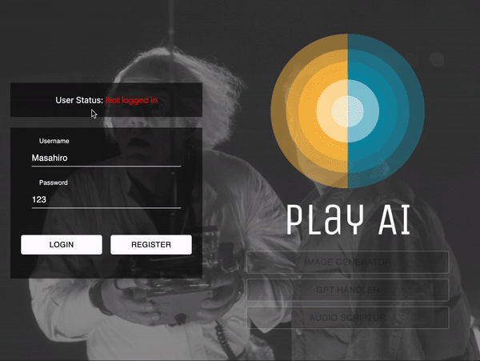
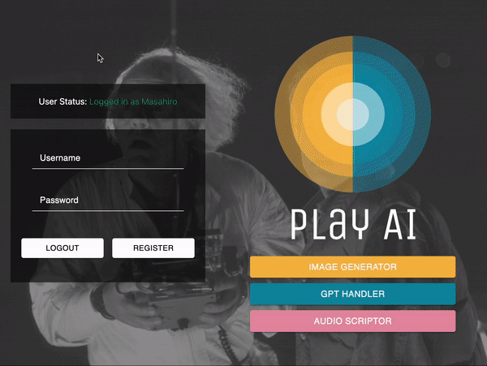

<h1 align="center">
Portfolio - Open AI Play Ground
</h1>
<h3 align="center">
🤖  Empower Every Day with AI Excellence! 🚀
</h3>

<p align="right"> 

</p>

## URL

&emsp;[OpenAI app - https://mkportfolio.link//](https://mkportfolio.link/)

<br>

## What user can do with this App
Simply, AI will help you to
- Create images.
- Answer the user's question.
- Transcript via audio file.


<br>

## Features
| Category   | Technologies                                            |
|------------|---------------------------------------------------------|
| Client     | React.js with Typescript, Redux, Tailwind, Material UI   |
| Server     | MongoDB, Express.js, Node.js                            |
| DevOps     | AWS (VPC, EC2, Route53, S3), Docker, Webpack            |
| AI/ML      | OpenAI API (GPT-3.5, DALL-E, Whisper)                   |
| Security   | Session management for user authentication              |
| Validation | Client:Input validation, Server: JOI module                    |


<br>


## Usage and Temrs of Use

 Usage
1. Register your name and password.
2. Go to the service page [Image Generator, GPT Handler, Audio Scriptor]
3. Make the setting if you need from Setting button.
   
 Note
- Because of the API cost meter, I have set up a usage limit (apologies).
- Therefore, you can use each service only once. This applies even if someone else has accessed this app from the same IP address and has already used the service more than once.
- If you would like to exceed these limits, please contact me via LinkedIn. I would be pleased to consider lifting the restrictions.


<br>

## Environment
| Category   | Technologies                                            |
|------------|---------------------------------------------------------|
| Client     | React.js with Typescript, Redux, Tailwind, Material UI   |
| Server     | MongoDB, Express.js, Node.js                            |
| DevOps     | AWS (VPC, EC2, Route53, S3), Docker, Webpack            |
| AI/ML      | OpenAI API (GPT-3.5, DALL-E, Whisper)                   |
| Security   | Session management for user authentication              |
| Validation | Input validation with the JOI module                    |
| Design     | Fully responsive design                                 |


<br>

## Deploy Environment

- AWS EC2 (For both client and server-side hosting)

<br>


## Demo

<br>

1. User registration, login, and logout functionalities. Redux manages access rights to other pages.  
<div>
	<h4 align="center">Validation - Registration - Login<h4>
    
	<h4 align="center">Logout<h4>
    
</div>

<br>

2. Demonstrating session persistence (session data is visible in both the database and browser inspection).
<div>
    
</div>

<br>

3. Image generation feature.
<div>
    
</div>


<br>

4. Chatting with AI functionality.
<div>
    
</div>


<br>

5. Audio transcription from audio files.
<div>
    
</div>


<br>

6. Error handling for unauthorized user access to service pages without logging in.
<div>
    
</div>


<br>

## Proud of

- Secure session handling with "express-session".
- Efficient state management using Redux.
- Docker ensures seamless app setup across different local environments.

<br>

## Future Enhancements

- Implementation and Enhancement of Testing:
	Implementation and strengthening of unit tests.
- Addition of Authentication Feature:
	Introduction of email-based user verification using AWS's SMTP.
- Linking API Responses to Individual Accounts:
	Enabling users to check API request responses tied to their own accounts.
- Image Download Feature:
	Addition of a feature for downloading images within the app.
- Introduction of CICD:
	Adoption of Continuous Integration and Continuous Deployment using AWS CodePipeline and Codebuild.
- Expansion of User Management Functions:
	Addition of user deletion and modification features.
- Optimization of Deployment Methods:
	Deployment of the static app on AWS S3.
	Configuration of the server side using AWS Lambda and API Gateway.

<br>

## Deploy Steps on your Local Machine

&emsp;First, you'll need to set up a Docker environment on your machine. Once done, run the following command in the root directory of the app:

```
docker-compose up
```

&emsp;Thanks to the inclusion of the "Concurrently" module, both client and server-side applications will run simultaneously.

&emsp;Lastly, ensure you have a .env file in the app's root directory. Define SESSION_SECRET with a random string and CHATGPT_APIKEY. Note: An API key from OpenAI is required, which might be paid.

```
NODE_ENV=development
REACT_APP_NODE_ENV=development
REACT_APP_CLIENT_PORT=3000
REACT_APP_SERVER_PORT=8000
REACT_APP_URL=http://localhost
MONGODB_PORT=27017
MONGODB_USERNAME=root
MONGODB_PASSWORD=gpt_mongo
MONGODB_DRIVER=mongodb://
MONGODB_DATABASE=mongo:27017/dev?authMechanism=DEFAULT&authSource=admin&directConnection=true
MONGODB_ATLAS_DEV=
MONGODB_ATLAS_PROD=
EXECUTABLE_DALL_E=true
EXECUTABLE_GPT=true
EXECUTABLE_WHISPER=true
IP_RESTRICTION=true
SESSION_SECRET=
CHATGPT_APIKEY=
```

<br>

## Directory Structure

```
GPT-APP # Root
├── (build) # Contains the production build of the project
├── config # Project configuration scripts and settings
├── public # Publicly served static assets like images and HTML files
├── scripts # Scripts for building, starting, and testing the project
│ ├── build.js # Script for building the project
│ ├── start.js # Script for starting the project
│ └── test.js # Script for running tests
├── src # Source code for the application
│ ├── client # Client-side application code
│ └── server # Server-side application code
├── Dockerfile # Instructions for creating a Docker container image
├── docker-compose.yml # Configuration for orchestrating multiple Docker containers
├── package-lock.json # Automatically generated file with exact versions of dependencies
├── package.json # Project metadata and dependencies
├── tailwind.config.js # Configuration for Tailwind CSS
├── tsconfig.json # TypeScript compiler configuration
└── README.md # Documentation and instructions for the project
```